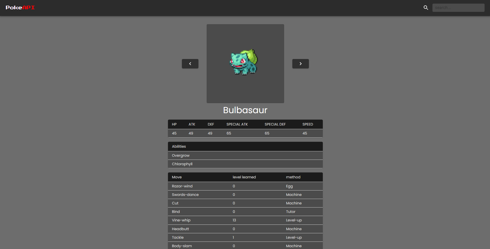

  

# React PokeApi

this project was created for fun, so i hope you enjoy like me

## About

It's possible pick any pokemon you want and see their Stats, Moves and Abilities

## Build With

- React js
- Material UI
- Node js
- CSS3
- vscode
- PokeApi

## Getting Started
Clone the repository with `git`. You will need `node.js`

### Run
Step 1
Install `npm`, you can install `yarn` too.

### Step 2
in the project directory, use: `npm` start or `yarn` start

😺😺😺😺😺😺😺😺😺😺😺😺😺😺😺😺😺😺😺😺😺😺😺😺😺😺😺😺😺😺
